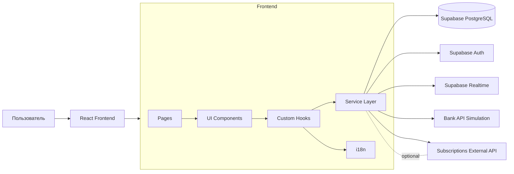
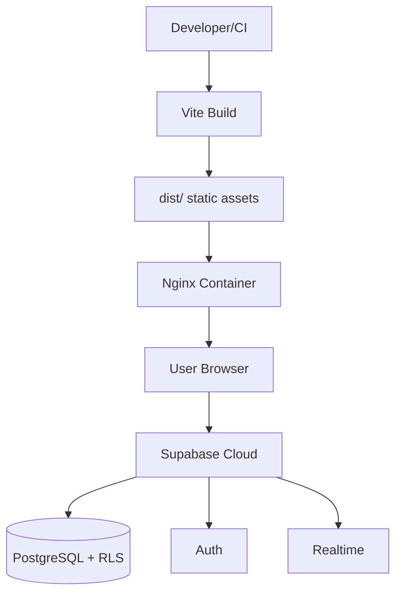
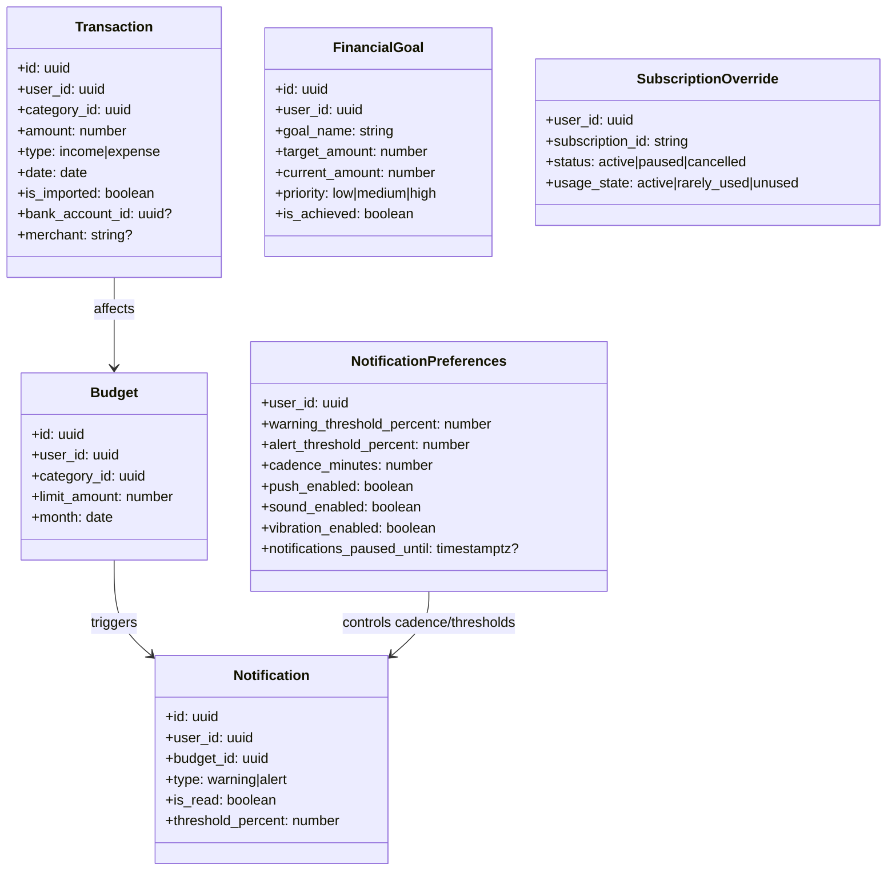
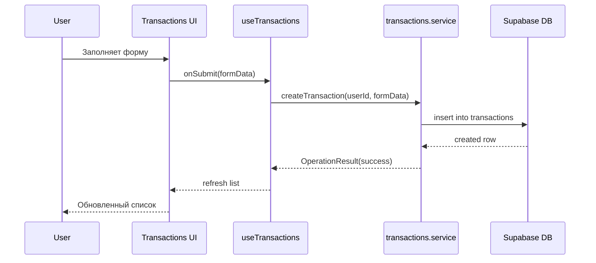
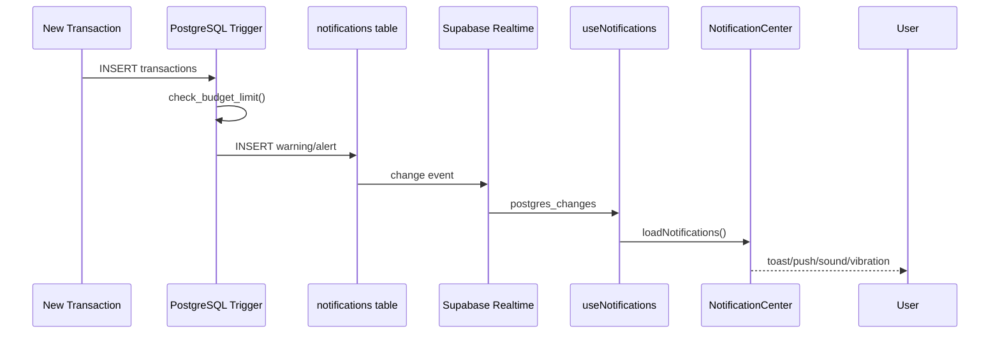
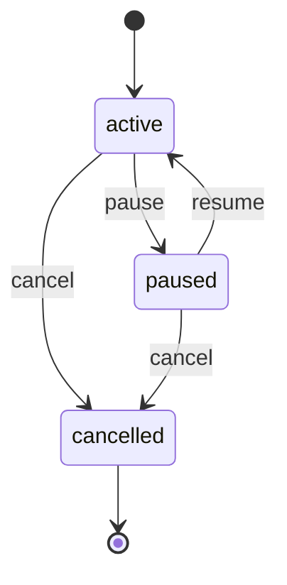
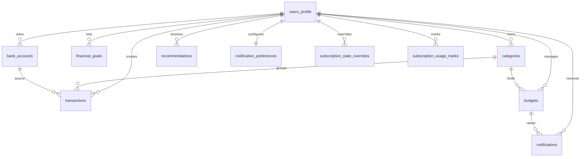

# Архитектурные схемы FinTrack

Документ описывает архитектуру системы на уровне модулей, взаимодействий и данных.

## 1. Высокоуровневая архитектура

### 1.1 Диаграмма компонентов



### 1.2 Диаграмма развертывания



## 2. Детальная архитектура

### 2.1 Основные frontend-модули

- `Dashboard`: мультивалютные счета, быстрая операция, сводка, последние транзакции.
- `Transactions`: CRUD транзакций, расширенные фильтры, управление категориями.
- `Budgets`: бюджеты по категориям, периодический расчет, визуальные алерты.
- `Analytics`: аналитические графики и список рекомендаций.
- `Reports`: генерация отчета и экспорт CSV/Excel/PDF.
- `Goals`: финансовые цели и прогресс.
- `Subscriptions`: регулярные списания, действия (pause/resume/cancel/mark_used), инсайты.
- `BankIntegration`: симулированное подключение банка и массовый импорт операций.
- `Settings`: язык и расширенные настройки уведомлений (threshold/cadence/channels).

### 2.2 Диаграмма классов (ключевые сущности)



### 2.3 Диаграммы последовательности

#### Сценарий: создание транзакции



#### Сценарий: бюджетный алерт



### 2.4 Диаграмма состояний (подписка)



## 3. Схема базы данных (ER)



## 4. Схема API и контрактов

Приложение использует Supabase как BaaS, поэтому основной API состоит из:

- Auth API (Supabase Auth).
- PostgREST-доступа к таблицам.
- RPC функций PostgreSQL.
- Realtime подписок.

### 4.1 RPC (ключевые)

- `generate_recommendations(user_id)` - автоматическая генерация рекомендаций.
- `generate_recommendations_manual(user_id)` - ручной запуск генерации (для authenticated).
- `check_budget_limit()` - триггерная функция лимитов бюджета.

### 4.2 Frontend service -> backend mapping

| Service | Основные методы | Backend target |
|---|---|---|
| `transactions.service.ts` | `getTransactions`, `createTransaction`, `createTransactionsBulk` | `transactions`, `categories`, `bank_accounts` |
| `budgets.service.ts` | `getBudgets`, `createBudget` | `budgets`, `transactions`, `categories` |
| `analytics.service.ts` | `getSummaryStats`, `getCategoryStats`, `getMonthlyTrend`, `getRecommendations` | `transactions`, `recommendations` |
| `goals.service.ts` | `getGoals`, `createGoal`, `toggleGoalAchieved` | `financial_goals` |
| `subscriptions.service.ts` | `getSubscriptions`, `applySubscriptionAction` | `subscription_state_overrides`, `subscription_usage_marks` или внешний API |
| `export.service.ts` | `exportTransactionsToCSV`, `exportReportToExcel`, `generatePDFReport` | client-side export |

### 4.3 Форматы запросов/ответов

Базовый контракт сервисов в коде:

```ts
type OperationResult<T> = {
  success: boolean;
  data?: T;
  error?: string;
};
```

Пагинированные выборки:

```ts
type PaginatedResult<T> = {
  data: T[];
  total: number;
  page: number;
  limit: number;
  hasMore: boolean;
};
```

## 5. Технические ограничения

- Банковская интеграция в `bankApi.service.ts` - симуляция.
- Подписки по умолчанию работают через `mock` провайдер.
- Браузерные push-уведомления зависят от разрешений Notification API.
- Реальный backend для подписок включается только при `VITE_SUBSCRIPTIONS_PROVIDER=api` и корректном наборе токенов/URL.
